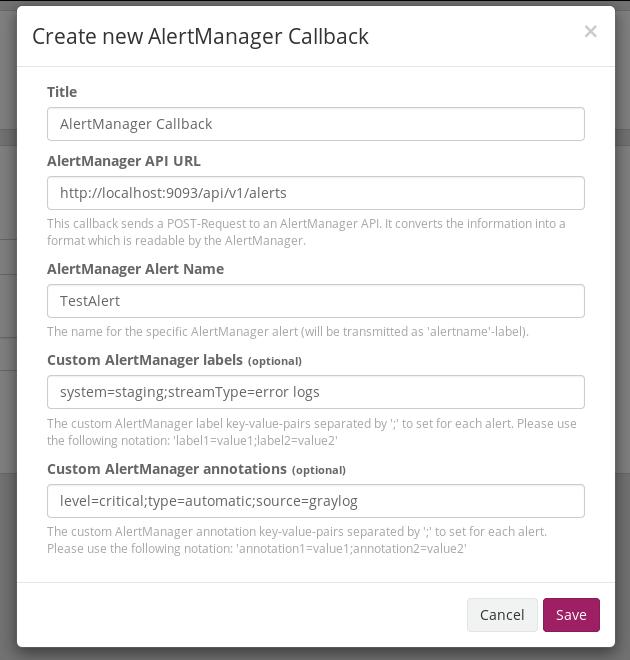

# Graylog AlertManager Notification Plugin   
This plugin can be used for connecting [Graylog](https://www.graylog.org/) alerts to the [Prometheus](https://prometheus.io/) [AlertManager](https://prometheus.io/docs/alerting/alertmanager/).

The plugin development is based on [Graylog2/graylog-plugin-sample](https://github.com/Graylog2/graylog-plugin-sample) which is mentioned in the [Graylog plugin documentation](http://docs.graylog.org/en/2.4/pages/plugins.html).

## Use Case
You are using a Graylog for checking the logs for errors, a Prometheus for checking the service metrics and you would like to organize your alerts with a AlertManager you need to get your Graylog alerts into the AlertManager.
This plugin provides the possibility to send your Graylog notifications with a AlertManager-Callback to your AlertManager.

## AlertManager Endpoint
The plugin uses the `/api/v1/alerts` endpoint of AlertManager. You can find some documentation about this endpoint [here](https://prometheus.io/docs/alerting/clients/).

## Provided Information
The plugin provides the AlertManager several information out of the box:
* `stream_title` - The title of the stream triggering the alert condition in Graylog
* `triggered_at` - The time of triggering the alert condition in Graylog
* `triggered_rule_description` - The generated rule description of triggered alert condition in Graylog
* `triggered_rule_title` - The title of alert condition rule in Graylog

All of those information will be added as annotation.

The values `startsAt`, `endsAt` and `generatorURL` will be transmitted to the AlertManager as well.
`startsAt` will be set to the point of time when the condition triggered the alert.
`endsAt` will be set to the point of time when the condition triggered the alert plus the set grace time which is configured for the alert.

## How to deploy on Graylog
You can easily build the plugin by executing `./gradlew build`. 
Afterwards there should be a `.jar` file inside the `build/libs/` directory.
Follow the instructions mentioned [here](http://docs.graylog.org/en/2.4/pages/plugins.html#installing-and-loading-plugins) to deploy this `.jar` file.

## Screenshots

## Planned Features
* Add possibility to define custom labels in UI when configuring the callback
* Add possibility to define custom annotations in UI when configuring the callback

You would like to contribute anything? - Take a look at [CONTRIBUTING.md](CONTRIBUTING.md).

## Known Issues
* The test-callback does not work as expected, it will cause an error instead of a notification
    * Workaround: You have to create a stream with a alert condition to test the callback

You would like to contribute anything? - Take a look at [CONTRIBUTING.md](CONTRIBUTING.md).

## License
See [LICENSE](LICENSE)

## Copyright

Copyright (c) 2019 G DATA Software AG and other authors.
